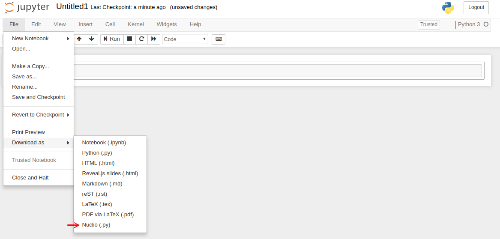

# nuclio Jupyter Export

<!--
Uncomment once we enable travis

[](https://travis-ci.org/nuclio/nuclio-jupyter) 
-->

[](https://opensource.org/licenses/Apache-2.0)

Convert Jupyter notebook to Python code that can run as [nuclio](https://nuclio.io/) handler

## Usage

When developing, import `Context` and `Event` from `nucilo` and use it to
generate a mock context and request.

```python
# nuclio: ignore
from nuclio import Context, Event

context = Context()
event = Event(body='Hello Nuclio')
# your code goes here
```

In the cell you'd like to become the handler, added the comment `#
nuclio:handler`. If there's a specific line you'd like to be the returned one -
added `# nuclio:return` at the end of it.

Cells containing `# nuclio: ignore` comment will be commented out in the export
process.

Now choose `File/Download as/Nuclio` in Jupyter notebook



Or you can run

```
jupyter nbconvert --to nuclio example.ipynb
```


This will create `example.py` with your code wrapped in handler function and all
cells with `# nuclio: ignore` commented out.

### Example


Will generate

```python
# coding: utf-8

# In[1]:
def greeting(name):
    return 'Hi ' + name + '. How are you?'

# In[2]:
default_name = 'Dave'

# In[3]:
# # nuclio:ignore
# from nuclio import Context, Event
# context = Context()
# event = Event(body=default_name)

# In[4]:
def handler(context, event):
    # nuclio:handler
    return greeting(event.body)
```

## Licence

Apache 2.0 (see [LICENSE.txt](LICENSE.txt))
